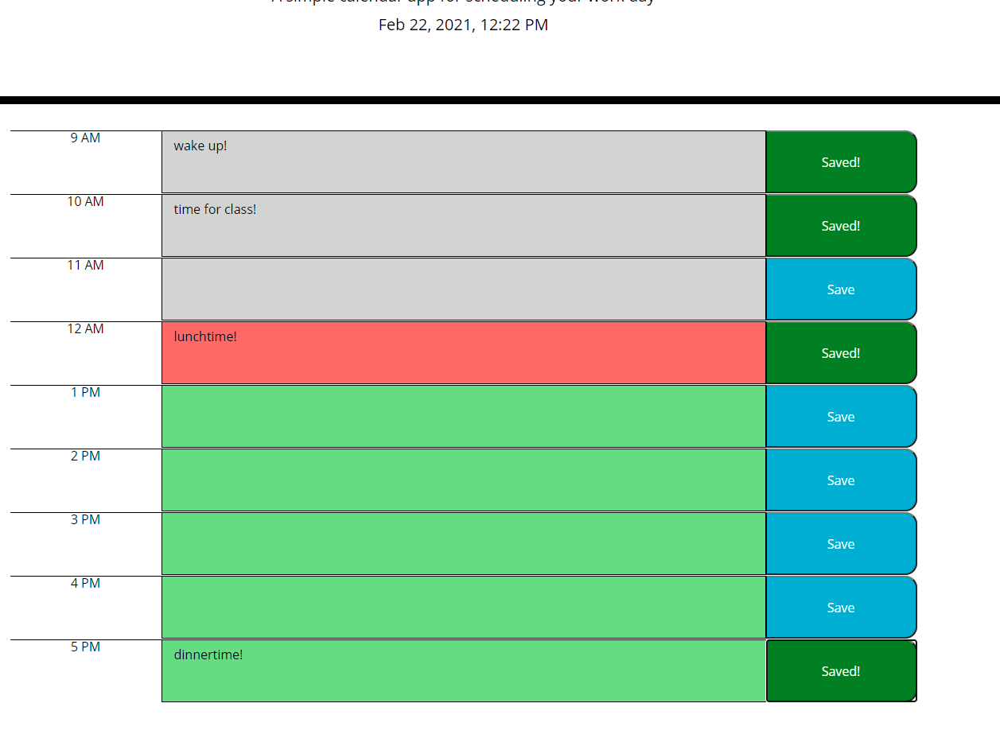
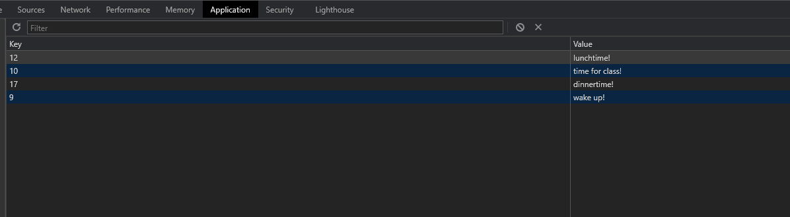

# JavaScript Hourly Planner

The goal behind this project was to create an planner inside a broswer that has functionality built-in with JavaScript. Javascript functionalities on this site include:

- Current date and time displayed at the top of the page using moment.js
- Time blocks are colored according to their relation with current moment.js time
- Text entries into the time blocks are saved into local storage and can be viewed upon later site visits until they are cleared from local storage 

Users can enter text into time-block elements and save, upon save time-block text is saved into local storage and held there until local storage is cleared. 

Data in the text area of the time blocks are stored locally until the clear button is clicked (or if a user chooses to clear local storage manually)

Users can choose to clear the planner with an added clear button. Clears the text field of any input and will also purge local storage. User schedule will be empty on next site visit if user clicks clear. 

## Installation and Usage 

To view and demo this project, follow this link to the deployed application hosted by github pages. 
[Link to deployed application]()